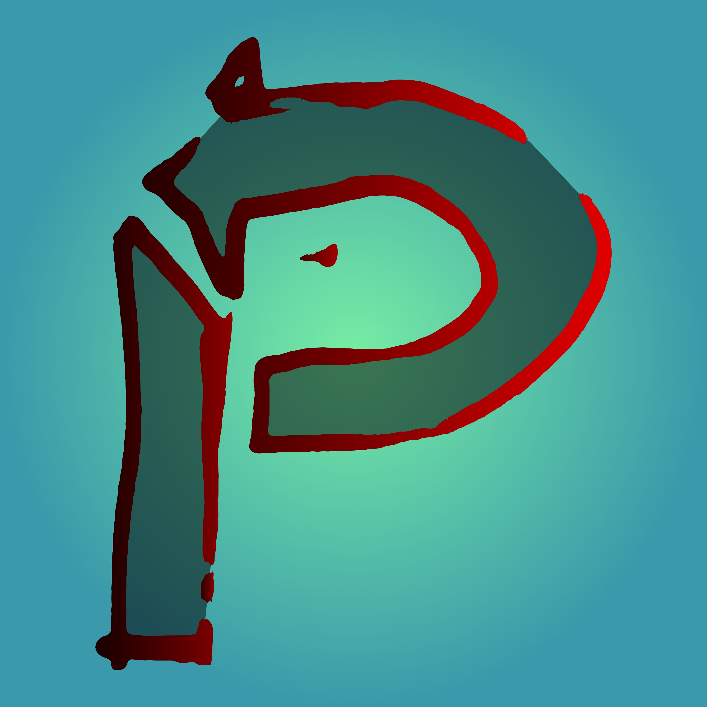

# Re:Play
## Codemonsters Laboratory




La idea que se está imponiendo es un juego similar a fall guys (carrera 3D) pero que durante la fase sea necesario ganar a varios microjuegos muy cortos (¿10 segundos de juego cada uno?) disponibles en máquinas recreativas a lo largo del escenario antes de llegar a la meta. Se podría jugar offline u online, pudiendo en este último caso molestar unos jugadores a otros durante la partida.


## Ideas:

**Véase: [Issue #2](https://github.com/codemonsters/re-play/issues/2)**

  
## Chuleta configuración VS Code y Godot
  Para abrir los scripts con VS Code, y no con godot, hay que hacer esto:
* En Godot ir a ```Editor>Configuración del editor```
* Ir a ```Text Editor > External```
* Activar ```Editor externo```
* En exec path poner la ruta al archivo ```code.cmd```
* A continuación, poner  ```{project} --goto {file}:{line}:{col}```.

Finalmente, instalar el plugin godot tools en VS Code.

¡Y ya está! ¡Puedes considerarte un genio!

## Enlaces

* [Awesome Godot](https://github.com/godotengine/awesome-godot) (lista con recursos para Godot como documentación, plugins, herramientas, etc).
